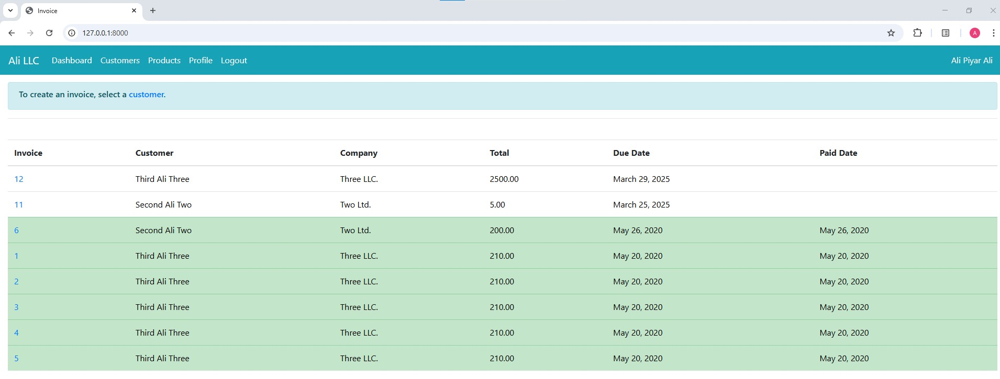
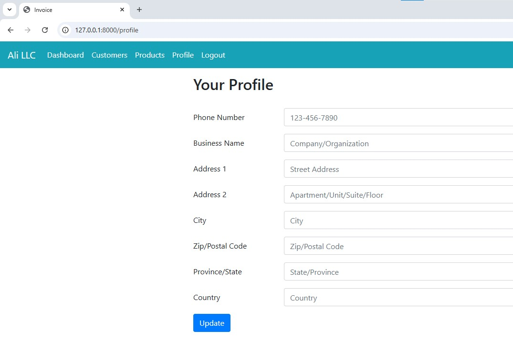
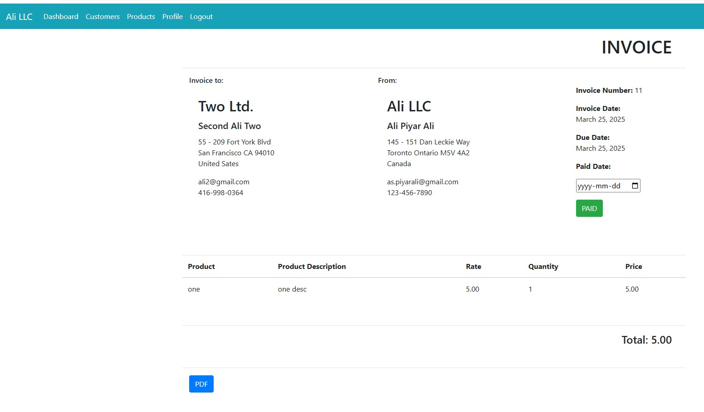
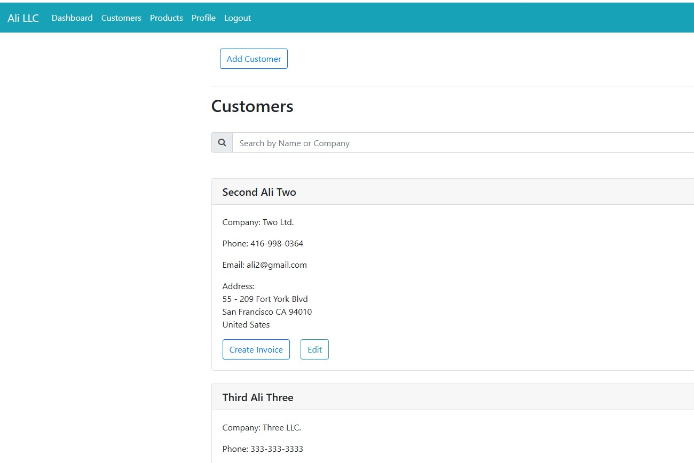
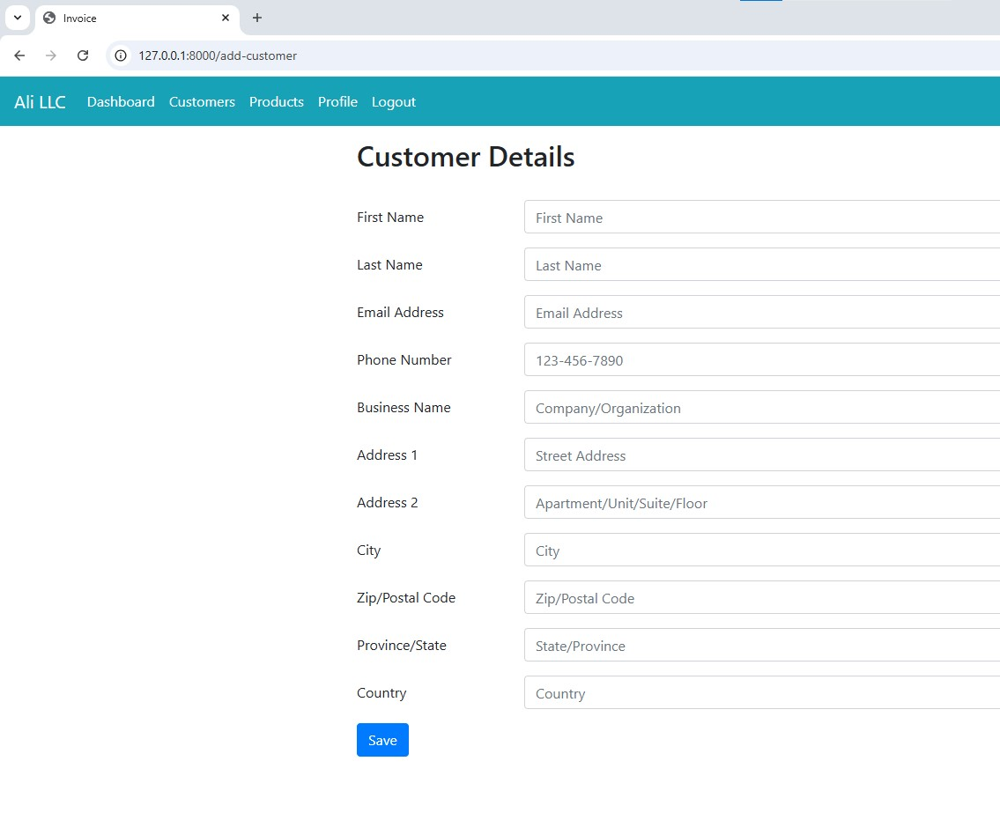
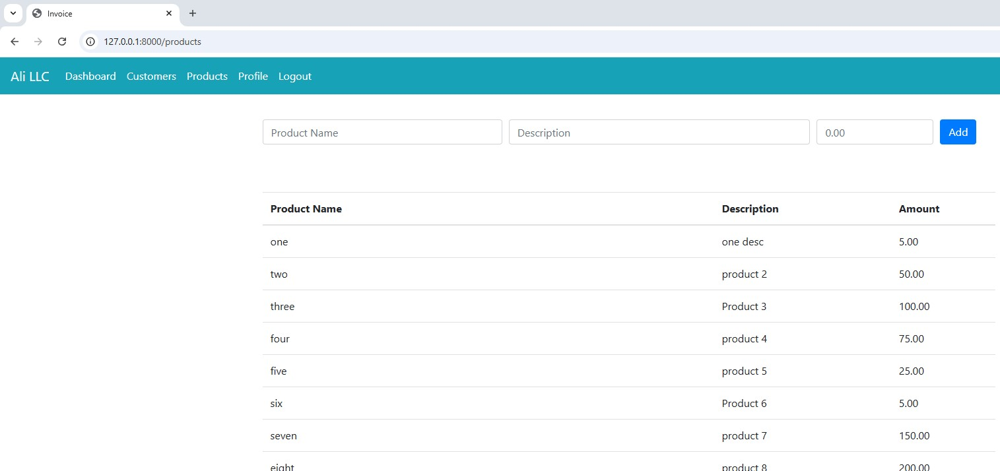
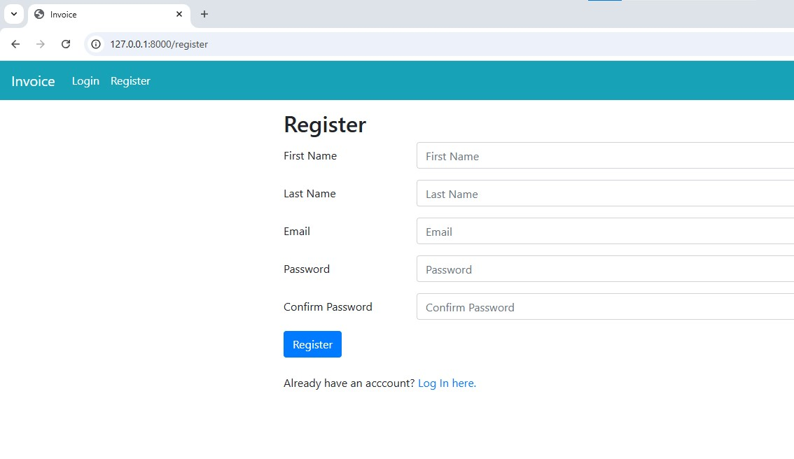
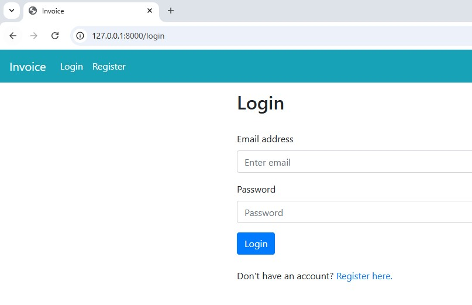

# Invoice App

## Description

This Python (Django framework) is for generating invoices for customers along with a product database and client database.

Users can add their own profile and client profile which will show on the invoice.

Users can also add products which will allow users to select products from the dropdown list when creating an invoice.

The app also allows converting invoices into PDF for emailing it to customers and marking invoices as paid when customer has paid.

### Instructions

Before running the app:
* Add your Django secret key under settings.py
* Make migrations (python manage.py makemigrations)
* Migrate (python manage.py migrate)
* Create superuser (python manage.py createsuperuser)
* For Google sign-in:
    * Set up Google OAuth Credentials and API from https://console.developers.google.com/
    * Log-in to Django app admin
    * Under Sites add your Domain and Display name
    * Under Social applicaitons:
        * Provider: Google
        * Name: Google API
        * Client id: your id from Google OAuth Credentials
        * Secret key: your secrete key from Google Oauth Credentials
* For sending password reset email using Gmail:
    * Go to http://myaccount.google.com/apppasswords
    * Under "Select the app and device..." option, click on the Select app dropdown and select "Other (Custom name)"
    * Enter the name of the app or any reference name.
    * Click Generate
    * Under settings.py, scroll to the email section:
        * Remove: "from . gmailUser import *"
            * Replace with: EMAIL_HOST_USER = 'YOUR EMAIL ADDRESS'
            * **_It is highly recommended that the email address should be stored in operating system environment variable, if thats the case then replace with: EMAIL_HOST_USER = on.eniron.get('EMAIL_USER')_**
        * Remove: "from . gmailPass import *"
            * Replace with: EMAIL_HOST_PASSWORD = 'YOUR GENERATED PASSWORD'
            * **_It is highly recommended that the password should be stored in operating system environment variable, if thats the case then replace with: EMAIL_HOST_PASSWORD = on.eniron.get('EMAIL_PASS')_**

### Screenshots

**Dashboard**

**Company Profile**

**Invoice**

**Customer**

**Add Customer**

**Product**

**User Registraton**

**Login**

